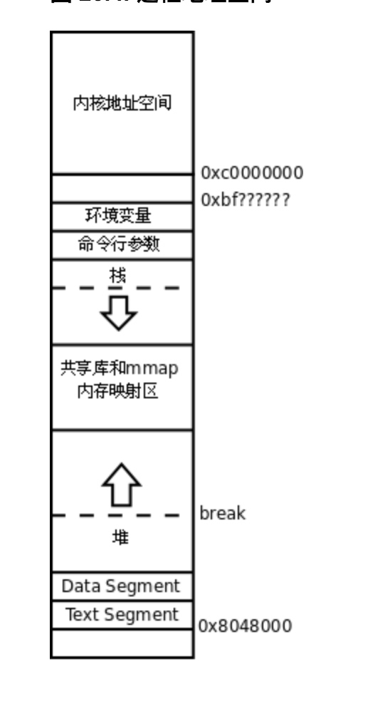
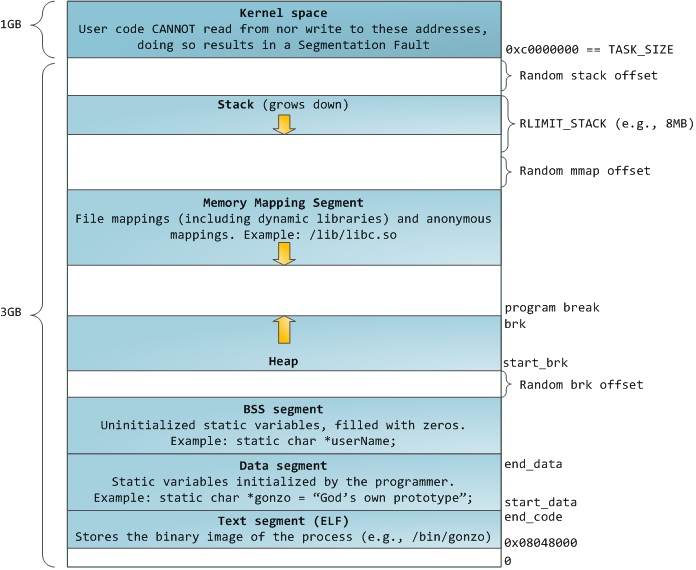
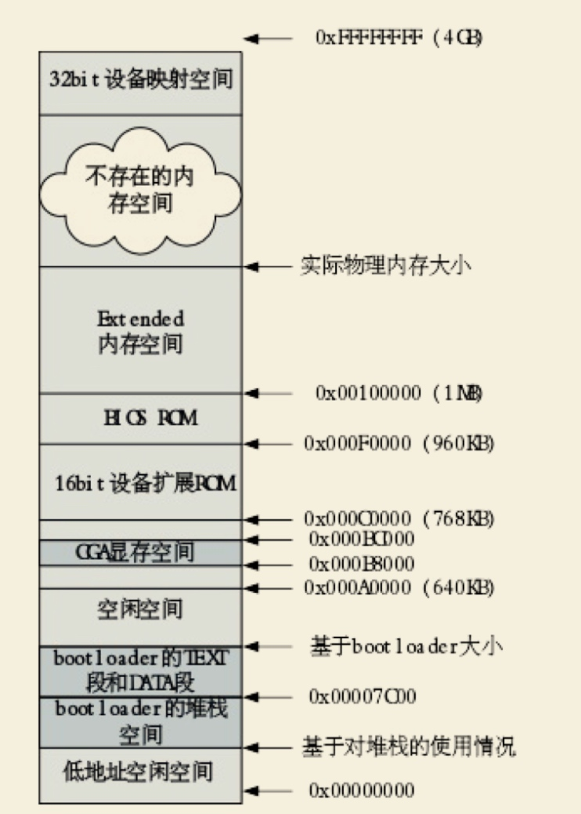

# 内存空间
Virtual:




Real:



```
+------------------+  <- 0xFFFFFFFF (4GB)
|     无效空间      |
|                  |
+------------------+  <- addr:3G+256M
|     256MB        |
|   IO外设地址空间   |
|                  |
+------------------+  <- 0xC0000000(3GB)
|                  |
/\/\/\/\/\/\/\/\/\/\

/\/\/\/\/\/\/\/\/\/\
|     无效空间      |
+------------------+  <- 0x40000000(1GB)
|                  |
|    实际有效内存    |
|                  |
+------------------+  <- 0x00100000 (1MB)
|     BIOS ROM     |
+------------------+  <- 0x000F0000 (960KB)
|  16-bit devices, |
|  expansion ROMs  |
+------------------+  <- 0x000C0000 (768KB)
|   VGA Display    |
+------------------+  <- 0x000A0000 (640KB)
|                  |
|    Low Memory    |
|                  |
+------------------+  <- 0x00000000
```
这个BIOS其实就是ROM过来的Shadow

