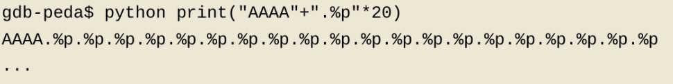

# 格式化字符串漏洞

## printf

printf语句的原型是 printf(format,...)

example: 

```C
char *a = scanf()
printf("%s",a)
```
这时的a被控制，但是format没有被控制

但是由于有时候直接写
`printf(a)`，所以用户可以控制format，这就很危险了

## 打印元素
###原理

- 于是当输入`a = %x %x %x %x %x %x`时，就可以一直讲esp+4来打印下一个参数，但实际上并没有下一个参数，就会从栈顶一直向下printf出栈内的东西

- 当format时%x时，如果栈内存的是指针，只会打印这个指针变量存的地址，但如果是%s时，系统会做一个 *（指针变量存的地址）的操作，就可以看到更多了

### %4s
%4s的意思是，在栈内找到第四个参数esp+16（根据具体情况也不一定是16），并print *(esp+16)

- 并不一定真正指定了4个及以上的参数，可以直接%4s，e.g.`printf("%5s")`

### 打印任意地址

核心是因为%s会做一次指针指向操作，所以当某一个参数是地址的时候，就可以找到这个地址中存的东西并打出。

在printf中，需要打印的语句亦是一个参数，那么只需要将参数设置为一个地址，例如\x7a\xd5\xff\xff(0xffffd57a)，当然，这个地址如果直接printf，结果只会是这个地址本身，需要用%s去打印*（地址）。在调用printf的时候，0xffffd57a就会被压入某一个位置，我们并不确定这个位置在哪，

这样，我们可以知道AAAA在内存的那个位置，比如说是13个参数，那么将AAAA替换为地址，并在format的地址后面写上%13$s即可。（%p这个字符串也会到栈中，但是会在AAAA之后）

>我们真正经常用到的地方是，把程序中某函数的 GOT 地址传进去，然后获得该地址所对应的函数的虚拟地址。然后根据函数在 libc 中的相对位置，计算出我们需要的函数地址（如   system() ）

## 向内存写入

### %
```C
int *i = 1
printf(%s %n, a, i)
```
%n有意思的地方在于，他并不输出到stdout, 而是输出到*i

### hh

例如printf("%hhd",56)
48在内存里是0x00000030，如果printf了48个字符，通过%7$n就会在第七个参数写入0x00000030，但是由于我们向写一个大数，这个大数有8位，我们如果直接构造%10000000c什么的内存占用太大，所以两位两位的写，每次就%7hhn，就只会在第七个参数上，写两位:48（默认会写8位）


## 命令used

checksec

