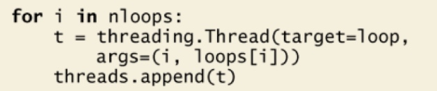
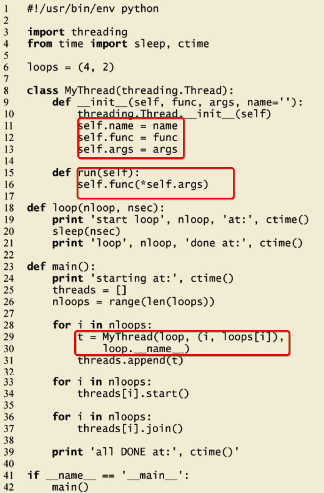

# 线程

Python 提供了多个模块来支持多线程编程，包括 thread、threading 和 Queue 模块等

>推荐使用更高级别的 threading 模块，而不使用 thread 模块有很多原因。threading 模块更加先进， 有更好的线程支持， 并且 thread 模块中的一些属性会和 threading 模块有冲突。徐@悀另一个原因是低级别的 thread 模块拥有的同步原语很少（实际上只有一个） ，而 threading 模块则有很多。


## thread类 from threading

- join (timeout=None): 直至启动的线程终止之前一直挂起；除非给出了 timeout（秒） ，否则会一直阻塞

名|用处
---|---
name | 线程名 
ident | 线程的标识符 
daemon | 布尔标志，表示这个线程是否是守护线程
join(timeout=None)| 直至启动的线程终止之前一直挂起；除非给出了 timeout（秒） ，否则会一直阻塞

>如果主线程还有其他事情要去做，而不是等待这些线程完成（例如其他处理或者等待新的客户端请求） ，就可以不调用 join()。join()方法只有在你需要等待线程完成的时候才是有用的。

在创建线程时，与传入函数相似的一个方法是传入一个可调用的类的实例，用于线程执行——这种方法更加接近面向对象的多线程编程。


###三种调用方式

1. 传入函数


2. 传入callable类

```
for i in nloops:
    t = threading.Thread(target=ThreadFunc(loop, (i, loops[i]),loop.__name__))
    threads.append(t)
```
这里ThreadFunc初始化了一个实例并传入

3. 继承threading.Thread类



在cookbook中好像不是很推荐第三种方法


## Event, Condition, Semaphore


