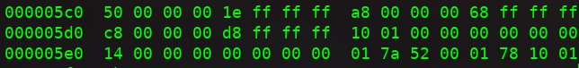

# 链接

[TOC]


例如次，一横排有16个比特(16进制的10)，每个bytes=8bit=两个十六进制数

##三个用到的工具：

- readelf
- nm
- objdump

输出C源代码和反汇编出来的指令对照的格式

objdump -S test.o
-d是反汇编


- symtab 是符号表，包括所有的函数名或者全局变量section名字，可以通过readelf -s或者nm可以看到，-S输出section header，nm不是直接看symtab，所以没有section的名字。

- 当看一个.o文件的符号中，第二列是U代表这个符号在这个文件当中被使用了，但是没有定义，需要在连接的其他文件当中寻找定义

- .shstrtab段保存着各Section的名字，.strtab段保存着程序中用到的符号的名字

- .rel.text告诉链接器指令中的哪些地方需要做重定位，在.o文件中需要重定位的符号一般会用0x0先暂时填充代替

```
Relocation section '.rel.text' at offset 0x2b0 contains 2 entries:
 Offset     Info    Type            Sym.Value  Sym. Name
00000008  00000201 R_386_32          00000000   .data
00000017  00000201 R_386_32          00000000   .data
```

- 在通过objdump 反汇编看到的内容中：

`<loop_exit>`并不是指令的一部分，而是反汇编器从.symtab和.strtab中查到的符号名称，写在后面是为了有更好的可读性


## 变量布局

在这一节中，想定位A的位置，

1. 通过看layout的符号表知道A在400594，
2. 然后在section中找400594发现属于rodate段，
3. rodate段的offset是3d0，这个本来是指在内存中的偏移但是在内存中的偏移和在文件中的偏移根据系统的要求是一致的，
4. 所以hexdump -C layout，-C用于在右侧显示ASCII码对应字符找到3d0位置的东西可以看到000a就是A

>Static类内部变量同auto自动变量（即未加 Static 声明的局部变量）一样，是某个特定函数的局部变量，即只能在定义该变量的函数内使用该变量，2者作用域相同；两者的不同在于：auto自动变量会随着函数被调用和退出而存在和消失，而static类局部变量不会，它不管其所在的函数是否被调用，都将一直存在；不过，尽管该变量还继续存在，但不能使用它。倘若再次调用定义它的函数时，它又可继续使用，而且保存了前次被调用后留下的值。换言之，Static类型的内部变量是一种只能在某个特定函数中使用，但一直占据存储空间的变量。

- const 在rodata中，只读变量在rodata中和.text共同组成一个只读的segment
- 不管是函数外还是内的static和global变量都在data中


## 链接详解

可以从stack这个数组看出来如果一个全局变量没有被定义的话还是会存在Bss段，

>???存在bss段那么久已经就内存中固定了，只有栈是在运行程序时改动的地方，那还怎么全局？？？

- 在stack.c定义的函数或者全局变量，在main.c 通过extern XXX 来声明一下继续使用
- 在stack.c 中定义的static变量，main.c中声明了也不能用


#####首先说为什么#include <stdio.h>用角括号，而#include "stack.h"用引号。

- 对于用角括号包含的头文件，gcc首先查找-I选项指定的目录，然后查找系统的头文件目录（通常是/usr/include，在我的系统上还包括/usr/lib/gcc/i486-linux-gnu/4.3.2/include）；
- 而对于用引号包含的头文件，gcc首先查找包含头文件的.c文件所在的目录，然后查找-I选项指定的目录，然后查找系统的头文件目录。

- 在#include预处理指示中可以使用相对路径，例如把上面的代码改成#include "stack/stack.h"，那么编译时就不需要加-Istack选项了，因为gcc会自动在main.c所在的目录中查找，而头文件相对于main.c所在目录的相对路径正是stack/stack.h

## 虚拟内存管理

不同的进程虽然共享libc所在的物理页面，但这些物理页面被映射到各进程的虚拟地址空间时却位于不同的地址，所以要求libc的代码不管加载到什么地址都能正确执行

每个进程的虚拟空间都是0x0000 0000-0xbfff ffff的地址空间,例如两个bash的内存布局几乎相同。因为这些地址是在编译链接时写进/bin/bash这个可执行文件的，两个进程都加载它。这两个进程在同一个系统中同时运行着，它们的Data Segment占用相同的VA，但是两个进程各自干各自的事情，显然Data Segment中的数据应该是不同的，相同的VA怎么会有不同的数据呢？因为它们被映射到不同的PA

