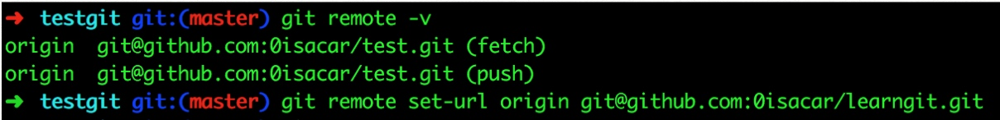
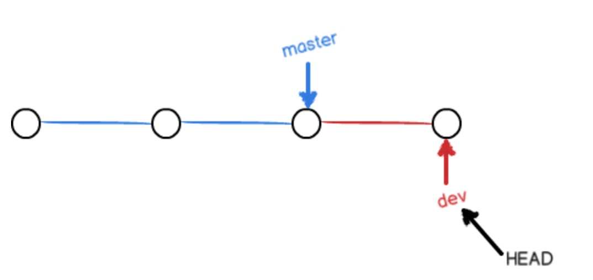
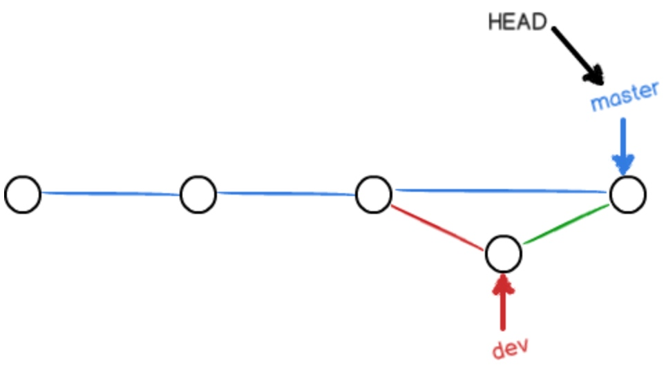
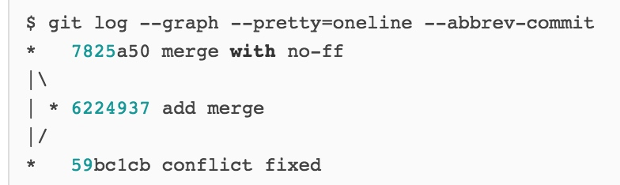

# origin note

## origin note

## git操作笔记

* [checkout, reset](origin-note.md#checkout-reset)
* [untrack files, changes not staged for commit](origin-note.md#untrack-files-changes-not-staged-for-commit)

### checkout, reset

1. 当前仓库下如果已经是clean的情况下，新建一个文件b，那么状态是有untracked files的

   不管是checkout 还是 reset 此时都没有什么用

当将b add到暂存区后，使用`git reset --hard HEAD`后就恢复clean了，可见，--hard会把暂存区更新到与HEAD中一样的状态

1. 1. 如果是在有一个untracked files **b** 并且在8c的情况下，`git reset head^^^^`后，跳到5c, 6个**untrack**,5个**unstaged**,这时候不能用checkout回8c
   2. 这时候通过`git reset 8c` 回到8c，只有一个b是untracked，以下三个实验均是从此状态出发
      * 这时候再用`git checkout 5c`回到5c的话，还是只有一个untracked b
      * 用`git reset 5c`回到5c, 有6个untrack, 5个unstaged
      * 用`git reset --hard 5c`回到5c, 有1个untracked b

**有untrack可以checkout, 有unstaged不能用checkout**

后面版本的HEAD区中的文件，如果前面版本没有，是untrack的

1. 关于checkout 和 reset 的几种操作
   * checkout
     * `git checkout filename` 使用暂存区或HEAD区中最近一次保存的状态去覆盖filename
     * `git checkout head^ filename` 使用head^中的filename覆盖当前工作区和暂存区的filename

       > 这一点与实验一致，在执行上一个版本后工作区和暂存区都是上一个版本的b.txt, 但是HEAD区是这个版本，所以显示需要commit

     * `git checkout tagname/commitHash` 切换到一个commit,然而head切换过去而master不会，所以head是detached，在这种情况下，任何修改commit后也没有意义, 游离的commit没有意义，这 时候必须要新建一个branch来保存他才能有意义,这种适合切换到这个分支搞一波编译或者破坏测试什么的就跑，不会造成影响。
   * reset
     * `git reset filename` reset head ^^ filename 和不加filename意义差不多，用指定的commit来替换现在的head,暂存区，如果加了--hard的话工作区也要替换，

       > 这也是为什么，一个错误的修改add之后可以reset来取消add，但是Untrack的文件即使是head区域里面也没有，所以reset --hard也没用

### untrack files, changes not staged for commit

* untrack files的意思是工作区与HEAD指向的区域中，新加的不一样的文件，可以add
* changes not staged for commit 是指工作区与HEAD指向的区域中都有，但是不一样的文件，同样可以add

> 删除 untracked files  
> git clean -f
>
> 连 untracked 的目录也一起删掉  
> git clean -fd
>
> 连 gitignore 的untrack 文件/目录也一起删掉 （慎用，一般这个是用来删掉编译出来的 .o之类的文件用的）  
> git clean -xfd
>
> 在用上述 git clean 前，墙裂建议加上 -n 参数来先看看会删掉哪些文件，防止重要文件被误删  
> git clean -nxfd git clean -nf git clean -nfd

### ignore

sometimes, .gitignore is included in work space, so if change .gitignore, itself will become unstaged. So:

.git/info/exclude

## checkout, reset

1. 当前仓库下如果已经是clean的情况下，新建一个文件b，那么状态是有untracked files的

   不管是checkout 还是 reset 此时都没有什么用

当将b add到暂存区后，使用`git reset --hard HEAD`后就恢复clean了，可见，--hard会把暂存区更新到与HEAD中一样的状态

1. 1. 如果是在有一个untracked files **b** 并且在8c的情况下，`git reset head^^^^`后，跳到5c, 6个**untrack**,5个**unstaged**,这时候不能用checkout回8c
   2. 这时候通过`git reset 8c` 回到8c，只有一个b是untracked，以下三个实验均是从此状态出发
      * 这时候再用`git checkout 5c`回到5c的话，还是只有一个untracked b
      * 用`git reset 5c`回到5c, 有6个untrack, 5个unstaged
      * 用`git reset --hard 5c`回到5c, 有1个untracked b

**有untrack可以checkout, 有unstaged不能用checkout**

后面版本的HEAD区中的文件，如果前面版本没有，是untrack的

1. 关于checkout 和 reset 的几种操作
   * checkout
     * `git checkout filename` 使用暂存区或HEAD区中最近一次保存的状态去覆盖filename
     * `git checkout head^ filename` 使用head^中的filename覆盖当前工作区和暂存区的filename

       > 这一点与实验一致，在执行上一个版本后工作区和暂存区都是上一个版本的b.txt, 但是HEAD区是这个版本，所以显示需要commit

     * `git checkout tagname/commitHash` 切换到一个commit,然而head切换过去而master不会，所以head是detached，在这种情况下，任何修改commit后也没有意义, 游离的commit没有意义，这 时候必须要新建一个branch来保存他才能有意义,这种适合切换到这个分支搞一波编译或者破坏测试什么的就跑，不会造成影响。
   * reset
     * `git reset filename` reset head ^^ filename 和不加filename意义差不多，用指定的commit来替换现在的head,暂存区，如果加了--hard的话工作区也要替换，

       > 这也是为什么，一个错误的修改add之后可以reset来取消add，但是Untrack的文件即使是head区域里面也没有，所以reset --hard也没用

## untrack files, changes not staged for commit

* untrack files的意思是工作区与HEAD指向的区域中，新加的不一样的文件，可以add
* changes not staged for commit 是指工作区与HEAD指向的区域中都有，但是不一样的文件，同样可以add

> 删除 untracked files  
> git clean -f
>
> 连 untracked 的目录也一起删掉  
> git clean -fd
>
> 连 gitignore 的untrack 文件/目录也一起删掉 （慎用，一般这个是用来删掉编译出来的 .o之类的文件用的）  
> git clean -xfd
>
> 在用上述 git clean 前，墙裂建议加上 -n 参数来先看看会删掉哪些文件，防止重要文件被误删  
> git clean -nxfd git clean -nf git clean -nfd

---

git init 新建 git config —global user.name git config —global user.email

vi readme.txt git add readme.txt git commit -m “haha”

vi readme.txt git status git add readme.txt git commit -m “hehe”

git log \(—pretty=oneline\)

git reset --hard HEAD^ 一个^代表上一个版本 git reset --hart HEAD~100

reset到A版本后，A版本之后的版本在log中就没有了 可以通过git reset --hart 3628164 到A后面的版本 \(git reflog看A之后版本的commit id\)

修改之后的status显示有变化，并且untracked add之后status显示有变化 commit之后status不显示有变化 log和reset都是针对 commit过的版本

commit只提交暂存区中，不提交工作区中的修改

git checkout -- filename 将工作区文件退回到最近一次\(add OR commit\) 的状态

## git rm filename 将“删除 filename" 这个修改放到暂存区，然后git commit 就将这个暂存区中的修改同步到库中

我把origin理解成一个指向远程仓库的指针 没有origin的话： git remote add origin git@github.com:michaelliao/learngit.git

git push -u origin master git push origin master

git clone git@github.com:michaelliao/gitskills.git

----------------------------------------------------分支------------------------------------------------------------

git branch 列出分支 git checkout master 切换到master git checkout -b haha 新建master并切换到master git merge haha 将当前分支 合并到haha\(例如快进到haha\) 经过尝试如果haha比master前面的话，haha不能merge到master 虽然这样的merge好像没有意义 A和B两个分支的文件如果同一个文件发生了不可调和的冲突，那么不能merge，手动修改文件到没有冲突后再merge

之前如果是 dev有修改 master merge 到dev 则是一条线直接合并 

git merge --no-ff -m "merge with no-ff" dev 

比fast forward多一个节点，可以显示一次信息 

为什么要有stash呢 是因为一旦一个分支haha是修改了没有add的话，切换到master了，master分区是haha更改之后的样子，haha分支commit完了再到master才是master本来的样子 如果haha分支修改了，add了但是没有commit的话，根本不允许切换到其它分支

所以 stash stash list stash apply

