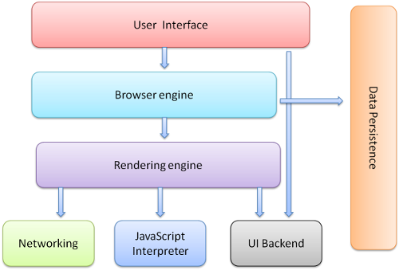
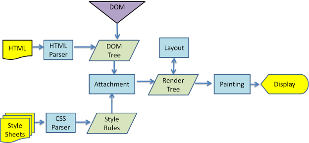
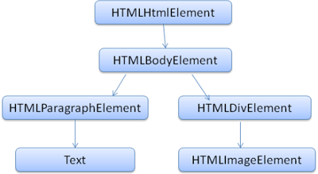
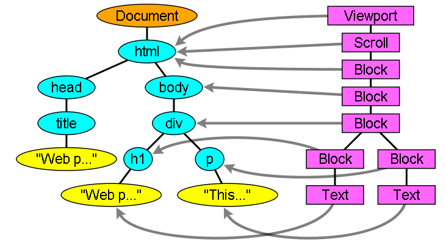

# browser

> some basic idea of how browser works
notes for https://www.html5rocks.com/en/tutorials/internals/howbrowserswork/#The_order_of_processing_scripts_and_style_sheets




- **the browser engine**: marhsals **actions** between UI and the rendering engine.

- **User interface**: things like back/forward button, bookmarmking menu.

- Rendering engine: the core
    - Networking: responsible for fetch files, like .html, .css, .img, .js


## rendering engine

1. networking fetch html.

2. parser parses all tags except <style> to construct DOM tree

3. networking fetches .css, then parser parses all <style> tags inside html, as well as all .css files, constructs **Style rules**

4. combiles `style rules` and `DOM tree` to render tree

5. render tree goes through `layout` process, to find out where exactly on the screen every node should be. 

6. painting, may coordinate with X something.

> For better user experience, the rendering engine will try to display contents on the screen as soon as possible. It will not wait until all HTML is parsed before starting to build and layout the render tree. Parts of the content will be parsed and displayed, while the process continues with the rest of the contents that keeps coming from the network.





### parsing

parsing in general could be divided into two subprocess - **lexical analysis**(by lexer) and **syntax analysis**(by parser)


### DOM

```html
<html>
  <body>
    <p>
      Hello World
    </p>
    <div> </div>
  </body>
</html>
```




> The parsing process is reentrant. For other languages, the source doesn't change during parsing, but in HTML, dynamic code (such as script elements containing document.write() calls) can add extra tokens, so the parsing process actually modifies the input.


### script

The model of the web is synchronous. Scripts are supposed to be parsed and executed immediately when the parser reaches a `<script>` tag. 
If the script tag is a external .js file, networking will fetch it and execute(also synchronously). If script is labeled with "defer" attribute, it will be execute after the document is parsed.

- speculative parsing: while executing a script, engine starts another thread parses the rest of the document, but this 'parse' actually only tries to find out `external` resources needs to be loaded from the network, and loads them. this doesn't modify the DOM tree, that is left to the main parser.

### Style sheets

unlike javascript, style sheet doesn't seem to change the DOM tree. there is no reason to wait for them and stop the document parsing. 
However, a lot of script will use the information from style sheets. For this scenario, Firefox blocks all scripts when there is a style sheet that is still being loaded and parsed. Webkit blocks scripts only when they try to access certain style properties that may affected by unloaded style sheets.


### Render tree

 


## why <script src> does not violate same-origin policy

- only inline script has "text" attribute. and only inline script is in DOM. so one can get access to the content of inline `<script> ` by using $('a').text, but if using this method to access external javascript, will return blank.

- So how can you get access to the content of external javascript? the only way is to make a ajax request, get the response. However, browser forbids you to get the resposne of the ajax if it's cross orgin. 

- Think of a external javascript file, it is simply fetched by network, and executed by `javascript interpreter` locally. That means when executing the javascript. The `document` it is manipulating is local document. 

- Browser does not protect current website's action towards current website. Instead, it protects "other" website. So if A.com import a javascript from b.com in its code. That pretty much means A.com trusts B.com. This apparently does not bother browser at all. 

- Remote scripts always execute in the security context of the document they are attached to, independent of their actual source. 

- being able to fetch and include remote javascript and image is based on the assumption that it's not harmful to get those things(not programmly) even if they are request with victim's cookie. No one can save the user's data in your website if you use a lot of JSONP something.
