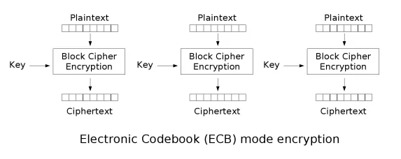
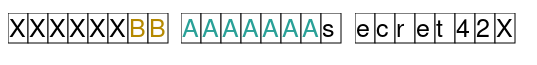
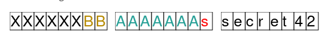

# chosen_plaintext

this is how ecb works 

Say there's a encrypted data, which can be divided into three parts
(encrypted 1)(encrypted data I can control plaintext)(excrypted 2)

first of all we may try to decide the block size.

## block size

AES is a block encyption (versus stream)  
which means the plaintext will be encrypted block by block  
different deploy will have different block size  
assume the block size is 16  
and we have a 34 bytes data needs to be encrypted  
it will be divided into 16-16-2
the last bytes will first be padded into(assume it's de ad)
de ad 0e 0e 0e 0e ... 0e 
0e(14) means padded 14 bytes

## crack ECB
### guess bytes distribution
let's say (encrypted 1) has 16+6 bytes
(encrypted 2) has 14+16 bytes

when I input 'a'*12,  
output data is 4 blocks long  
but when I input 'a'*13
output data is 5 blocks log(4*16+1)  
then I may know these two parts are 52 bytes long(lacking for 12 bytes)

when length(input) changes from 0 to 10 bytes  
the second part of encrypted data always change,  
once the input over 10 bytes, it stop changing.  
Then I can know the second part is 16-10=6 bytes long.

### start guess part 2

input: 'a'\*10+'a'\*15

the first 10 a is for fill the second block

when I input 15 bytes as the third block, the first byte of part 2 will fill the last byte.

the I can get the result of this encrypted block 3 $en_b3

then input: 'a'\*10 + 'a'\*15 + guess_byte  

by input different guess_byte, when the encrpted third block is the same as $en_b3, it means guess_byte is equal to the first byte of part 2.

then I can start to guess the second byte of part 2...

black means those fixed bytes(part1 part2)

both brown and blue and red are my input, (brown for padding, blue for constructing guessing block, red for guess)