# natas\_review

## natas0

view page source 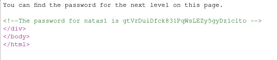

## natas1

the password is also in the page source, but right click is banned, use F12 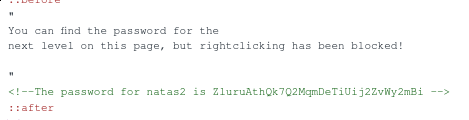

## natas2

No password in page source, but there's a image 

reminds me of seeing what's in "files"


got the password

## natas3

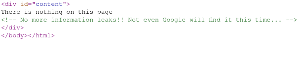

view the page source, these might be a hint. When google scraping pages over Internet, every site can have a file named "robots.txt" to tell google which files shouldn't be scrape.


the password is in that directory

Z9tkRkWmpt9Qr7XrR5jWRkgOU901swEZ

## natas 4


this seems to tell me I have to have "Referrer" equal to they give me, After change the Referrer, get the password

iX6IOfmpN7AYOQGPwtn3fXpbaJVJcHfq

## natas5

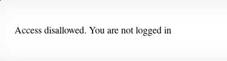

says I should log in. How does it know wether I'm log in? maybe cookie or something, so I check my request headers


after changing loggedin from 0 to 1, got the password

aGoY4q2Dc6MgDq4oL4YtoKtyAg9PeHa1

## natas6


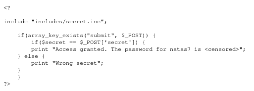

the include is very suspicious, so I check what's in it. I got

```text
<?
$secret = "FOEIUWGHFEEUHOFUOIU";
?>
```

Then, return to main page, input the secret

got the password 7z3hEENjQtflzgnT29q7wAvMNfZdh0i9

## natas7


the "page=" is suspicious there might be code like `include $_REQUEST['page']`

So I try ?page=../../../../../../../etc/natas\_webpass/natas8

got the password DBfUBfqQG69KvJvJ1iAbMoIpwSNQ9bWe

## natas 8

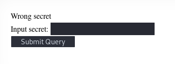


So it's very obvious

the strrev function in php means reverse the string

use python code

```text
base64.b64decode(binascii.unhexlify('3d3d516343746d4d6d6c315669563362')[::-1])
```

can get the secret, input the secret can get the password W0mMhUcRRnG8dcghE4qvk3JA9lGt8nDl

## natas9


check the source code

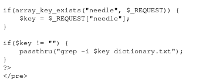

What I need to do is inject the code and get the password in `/etc/natas_webpass/natas10`

use `;cat /etc/natas_webpass/natas10;` got the password

nOpp1igQAkUzaI1GUUjzn1bFVj7xCNzu

## natas10

this time, it filters some of characters 

payload: `-E .* /etc/natas_webpass/natas11`

will execute `grep -i -E ./* /etc/natas_webpass/natas11 dictionary.txt`

this means match all characters in natas11 and dictionary.txt


## natas11


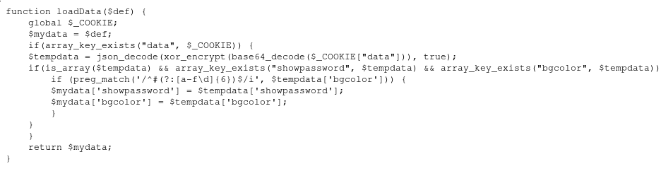

there's a cookie field "data"

it's a json data, being xor'ed then base64 encoded

All I have to do is: 1. check my cookie 2. base64 decode it 3. find xor key, then decode it 4. change the "no" for showpassword to "yes" 5. xor, base64 encode, change my cookie to modified one.

the way I can get the key of XOR is to change the "bgcolor" then observe change in cookie

I send two requests, with bgcolors are "\#000000" and "\#ffffff"

115e2c17115e 47087a414708

these are two different snippet so maybe I can know the length of key is 4 bytes

I try to do

```text
ord('f')^(0x11)
ord('0')^(0x47)
```

both got result 119, so I guess this is the first digit of xor key

the key is "w8Jq"

To code myself the decode something is troublesome So what I do is copy the code of natas11 to my computer, change the $key to w8Jq Then just run it, and got the cookie, can change the cookie for "real natas11"

it's wrong, and I finally know that the order of my key is wrong, it should be "qw8J" the different chunk of datas from two requests may be encrypted from the middle of the $key. So after I guess out the key, I should tweak the order

the password is EDXp0pS26wLKHZy1rDBPUZk0RKfLGIR3

## natas12


This challenge let me to upload a image

The problem is that this code let client check the filename. So I can change the name to .php

got the password jmLTY0qiPZBbaKc9341cqPQZBJv7MQbY

## natas13

compared to natas12 natas13 has a check `exif_imagetype` this function in php check if the first four bytes of a file is "image header" ffd8ffe0, if little endian. It's d8ff e0ff\(as hexdump\)

almost the same way as natas12, got the password Lg96M10TdfaPyVBkJdjymbllQ5L6qdl1

## natas14

very simple sql injection " or 1=1 --

AwWj0w5cvxrZiONgZ9J5stNVkmxdk39J

## natas15

I test error based injection but this is pure blind injection

wrote a python script to get password

## natas16

This is also a "blind injection"


also search things from dictionary.txt, but with very strong filter

grep -i "$needle" dictionary.  
almost all special characters are banned

the way to blind injection is intereating because the variable I can manipulate is quoted, I can't escape it

payload:

```text
$(grep -E ^a0n.* /etc/natas_webshell/natas19)hack
```

the result of the first setence will be stitched to "hach" the entire setence is like:

```text
grep -i "$grep -E ^a0n.* /etc/natas_webshell/natas19)hack" dictionary.txt
```

The dictionary has the word "hack", if nothing got in $grep, then it's like grep -i hack dictionary

But if somthing is got. it's like grep -i a0nhack dictionary. The answer is obvious nothing.

Then, this is a boolen injection

## natas 17

time based blind injection xvKIqDjy4OPv7wCRgDlmj0pFsCsDjhdP

## natas 18

this challenge let me login as admin but whether I'm admin or not has nothing to do with my username. As per the code, it test if I'm an admin by looking for $\_SESSION\['admin'\]

and I saw that the PHPSESSIONID in cookie is very small integer, so brute force the ID that is admin

## natas 19

It says the code is almost the same as natas18

I check cookie, the session id looks like a hex

3537332d61646d696e with python's binascii.unhexlify I got "573-admin". So brute force the first digits, then got the admin and password

## natas 20

This challenge defines its own way of reading and writing SESSION

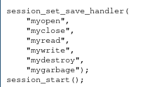

### key functions

#### use Params to set SESSIOn

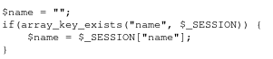

#### save SESSION in file

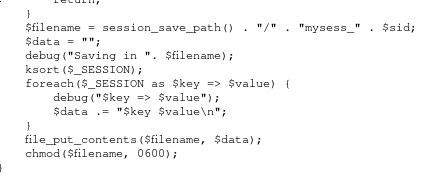

As the code reveals, session array is saved in file using format like key\(space\)value


So if I submit name as a\nadmin 1 they might be saved in two lines And when they are read, they will be treated as two entries

**notice** the hex of '\n' is not 10 is 0a

got the password IFekPyrQXftziDEsUr3x21sYuahypdgJ

## natas 21

natas 21 has two sites

they have different domain, so in default, the browser store their cookie separately.

Whay I did is sening a request to website \#2, got my SESSION\['admin'\] set, and got cookie for website\#2

Then, request website\#2 using the cookie got from website\#2

chG9fbe1Tq2eWVMgjYYD1MsfIvN461kJ

## natas 22

in source code `header("Location: /")` will respond with code 302, and will be relocate.

But before relocation, the password has been revealed. So use burpsuiteto get the response before relocation

D0vlad33nQF0Hz2EP255TP5wSW9ZsRSE

## natas 23


strstr in php means the index param1 first time show up in param2 so send with password 11iloveup

OsRmXFguozKpTZZ5X14zNO43379LZveg

## natas 24


the key to bypass strcmp is to send ?passwd\[\]=

## natas 25


natas 25 is like abobe

it seems that the only thing I can control is language, a get param


the good news is the set Language method is very unsafe, it's realized by using "include"


However, safeinclude function filter "../" and natas\_webpass even though I can bypass the ../ by using "....//", the other one is hard to bypass


The log function offers a way to bypass. It logs HTTP\_USER\_AGENT without any filter

### solution

send request with header HTTP\_USER\_AGEN = &lt;?php passthru\(cat "/etc/natas\_webpass/natas26\); ?&gt;

and then, use the ?lang parameter to include the log file

## natas 26


### key functions


I can send a request with serialized class Logger, and its exitMsg is `<?php passthru("cat /etc/natas_webpass/natas27"); ?>` and the logFile is /img/a.php

then request /img/a.php will get the password

## natas 27

all inputs are filtered in natas 27 and almost impossinle to bypass

Since the username doesn't exist will be created. I can use MYSQL truncate vulnerability to create new user "natas28"

by reading the source code, I know that the max size of username is 64

So I can send username 'natas28' + ' '\*60 + 'a'

when this username first reach the sever side, server query this username in database

space will be ignored when do mysql query so if I do not add 'a' at the end, it returns "password incorrect"

so the real query is "natas28 a", it doesn't exists then, INSERT natas+''\*60+'a' first, all things more than 64 bytes will be discarded then, all space that has nothing behind them will be discarded, in this way, all the spaces were discarded, So I insert a new natas28, with my password

## natas 28


### flow of natas 28

1. first I input search as post data in index.php
2. index.php concat my search content with things like: select joks in jokes where content like "%escaped\_input%"
3. then this query will be encrypted with AES at ECB mode. then send to search.php by GET param
4. search.php decrypts the data and do query


This is how ECB mode works,

Since every block is independent, we can construct a SQL injection `' union select password from users #` In this query, only `'`will be escaped, becomes `\'`

What I can do is let  and ' in different block, then concat the second block\(without \) with a "good block" In this way, we bypass the escaping

!! notice that the data I input must be in the middle of the query\(which will be encrypted later\). So I have to do test to know the distribution of the whole sentence\(like how many bytes before my input and how many after my input\)

