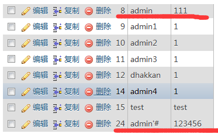

# second

in php, there're two mysqli functions. They are **mysqli_real_escape_string** and **mysqli_escape_string**. They are similiar, but mysqli_real might be better

in Less-24

All input strings are escaped. and this escape is for mysql, not PHP  
This means.

When I register a usernaem **admin '#**

the SQL should be `insert into users (username,password) values('admin \'#',"123")`
SQL knows quote in `admin '#` is part of username.

the real username being stored in database does NOT include '\' 



## attack

even though all the input strings are escaped at the first time.

however, after login, when changing password, the username is directly retrieve from database.

```PHP
function sqllogin
    $row = mysql_fetch_row($res);
    return $row[1];

$login = sqllogin();
$_SESSION["username"] = $login;
```

```PHP
$username= $_SESSION["username"];
$sql = "UPDATE users SET PASSWORD='$pass' where username='$username' and password='$curr_pass'";
```

the `admin '#` will be retrieved
the update sql will be `UPDATE users SET PASSWORD='$pass' where username='admin'# ........

So we change the password of the real admin,
the password of `admin '#` is not changed