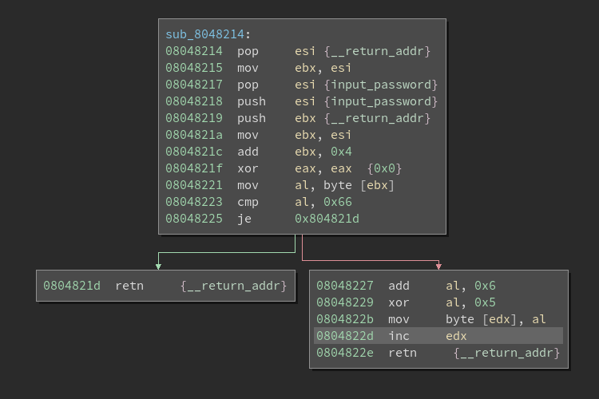

# f1nd\_my\_k3y5

#### sub\_8048214

This function simply compares the 5th char of input with 0x66\('f'\).

0x80494a0 stores a array. if the 5th byte is not 'f', add 5th char with 0x6, and xor it with 0x5. 

